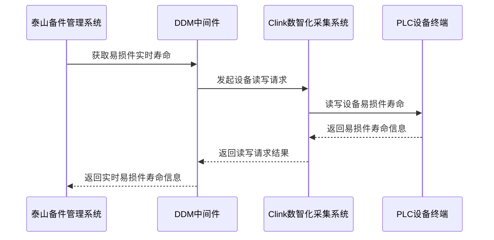

# 易损管理原型设计

* **寿命获取序列图**

```mermaid
sequenceDiagram
    participant 泰山备件管理系统
    participant DDM中间件
    participant Clink数智化采集系统
    participant PLC设备终端

    泰山备件管理系统->>DDM中间件: 获取易损件实时寿命
    DDM中间件->>Clink数智化采集系统: 发起设备读写请求
    Clink数智化采集系统->>PLC设备终端: 读写设备易损件寿命

    PLC设备终端-->>Clink数智化采集系统: 返回易损件寿命信息
    Clink数智化采集系统-->>DDM中间件: 返回读写请求结果
    DDM中间件-->>泰山备件管理系统: 返回实时易损件寿命信息
```
----

